# Entity-Relationship Diagram

## Enterprise Real-Time Attendance & Occupancy Tracking System (ERAOTS)

---

## ER Diagram

```mermaid
erDiagram
    DEPARTMENT {
        uuid department_id PK
        varchar name
        varchar description
        uuid manager_id FK
        boolean is_active
        timestamp created_at
        timestamp updated_at
    }

    EMPLOYEE {
        uuid employee_id PK
        varchar first_name
        varchar last_name
        varchar email
        varchar phone
        uuid department_id FK
        varchar fingerprint_hash
        varchar profile_image_url
        date hire_date
        varchar status
        timestamp created_at
        timestamp updated_at
    }

    USER_ACCOUNT {
        uuid user_id PK
        uuid employee_id FK
        varchar email
        varchar password_hash
        uuid role_id FK
        boolean is_active
        boolean mfa_enabled
        varchar mfa_secret
        timestamp last_login
        timestamp created_at
        timestamp updated_at
    }

    ROLE {
        uuid role_id PK
        varchar name
        jsonb permissions
        varchar description
        timestamp created_at
    }

    SCANNER {
        uuid scanner_id PK
        varchar name
        varchar door_name
        varchar location_description
        varchar api_key_hash
        varchar status
        integer heartbeat_interval_sec
        timestamp last_heartbeat
        timestamp installed_at
        timestamp created_at
        timestamp updated_at
    }

    SCAN_EVENT {
        uuid event_id PK
        uuid scanner_id FK
        uuid employee_id FK
        varchar fingerprint_hash
        timestamp scan_timestamp
        varchar direction
        varchar event_source
        boolean is_valid
        varchar rejection_reason
        jsonb raw_data
        timestamp created_at
    }

    OCCUPANCY_STATE {
        uuid state_id PK
        uuid employee_id FK
        varchar current_status
        uuid last_scan_event_id FK
        timestamp last_state_change
        timestamp updated_at
    }

    ATTENDANCE_RECORD {
        uuid record_id PK
        uuid employee_id FK
        date attendance_date
        timestamp first_entry
        timestamp last_exit
        integer total_time_in_building_min
        integer total_active_time_min
        integer break_count
        integer total_break_duration_min
        varchar status
        boolean is_late
        integer late_duration_min
        integer overtime_duration_min
        integer punctuality_score
        timestamp created_at
        timestamp updated_at
    }

    SCHEDULE {
        uuid schedule_id PK
        varchar name
        varchar description
        time start_time
        time end_time
        integer grace_period_min
        uuid department_id FK
        boolean is_default
        timestamp created_at
        timestamp updated_at
    }

    EMPLOYEE_SCHEDULE {
        uuid id PK
        uuid employee_id FK
        uuid schedule_id FK
        date effective_from
        date effective_to
        timestamp created_at
    }

    LEAVE_TYPE {
        uuid leave_type_id PK
        varchar name
        integer max_days_per_year
        boolean is_paid
        boolean requires_approval
        timestamp created_at
    }

    LEAVE_REQUEST {
        uuid leave_id PK
        uuid employee_id FK
        uuid leave_type_id FK
        date start_date
        date end_date
        text reason
        varchar status
        uuid reviewed_by FK
        text review_comment
        timestamp reviewed_at
        timestamp created_at
        timestamp updated_at
    }

    HOLIDAY {
        uuid holiday_id PK
        varchar name
        date holiday_date
        boolean is_recurring
        timestamp created_at
    }

    NOTIFICATION {
        uuid notification_id PK
        uuid recipient_id FK
        varchar title
        text message
        varchar type
        varchar channel
        varchar priority
        boolean is_read
        timestamp read_at
        varchar delivery_status
        timestamp created_at
    }

    NOTIFICATION_PREFERENCE {
        uuid preference_id PK
        uuid employee_id FK
        varchar notification_type
        boolean in_app_enabled
        boolean email_enabled
        boolean whatsapp_enabled
        timestamp updated_at
    }

    CORRECTION_REQUEST {
        uuid correction_id PK
        uuid employee_id FK
        date correction_date
        uuid original_event_id FK
        varchar correction_type
        timestamp proposed_time
        text reason
        varchar status
        uuid reviewed_by FK
        text review_comment
        timestamp reviewed_at
        uuid created_event_id FK
        timestamp created_at
        timestamp updated_at
    }

    POLICY {
        uuid policy_id PK
        varchar name
        varchar description
        varchar policy_type
        jsonb value
        uuid department_id FK
        boolean is_active
        date effective_from
        timestamp created_at
        timestamp updated_at
    }

    EMERGENCY_EVENT {
        uuid emergency_id PK
        uuid activated_by FK
        timestamp activation_time
        timestamp deactivation_time
        varchar emergency_type
        integer headcount_at_activation
        text notes
        varchar status
        timestamp created_at
    }

    EMERGENCY_HEADCOUNT {
        uuid id PK
        uuid emergency_id FK
        uuid employee_id FK
        varchar status_at_event
        boolean accounted_for
        varchar last_known_door
        timestamp accounted_at
    }

    SCANNER_HEALTH_LOG {
        uuid log_id PK
        uuid scanner_id FK
        varchar status
        integer response_time_ms
        text error_message
        timestamp checked_at
    }

    AUDIT_LOG {
        uuid audit_id PK
        uuid user_id FK
        varchar action
        varchar entity_type
        uuid entity_id
        jsonb old_value
        jsonb new_value
        varchar ip_address
        timestamp created_at
    }

    %% ===== RELATIONSHIPS =====

    DEPARTMENT ||--o{ EMPLOYEE : "has members"
    DEPARTMENT ||--o| EMPLOYEE : "managed by"
    DEPARTMENT ||--o{ SCHEDULE : "has schedules"
    DEPARTMENT ||--o{ POLICY : "has policies"

    EMPLOYEE ||--|| USER_ACCOUNT : "has account"
    EMPLOYEE ||--o{ SCAN_EVENT : "generates"
    EMPLOYEE ||--|| OCCUPANCY_STATE : "has state"
    EMPLOYEE ||--o{ ATTENDANCE_RECORD : "has records"
    EMPLOYEE ||--o{ LEAVE_REQUEST : "submits"
    EMPLOYEE ||--o{ NOTIFICATION : "receives"
    EMPLOYEE ||--|| NOTIFICATION_PREFERENCE : "has preferences"
    EMPLOYEE ||--o{ CORRECTION_REQUEST : "submits"
    EMPLOYEE ||--o{ EMPLOYEE_SCHEDULE : "assigned to"
    EMPLOYEE ||--o{ EMERGENCY_HEADCOUNT : "tracked in"
    EMPLOYEE ||--o{ AUDIT_LOG : "performs"

    USER_ACCOUNT }o--|| ROLE : "has role"

    SCANNER ||--o{ SCAN_EVENT : "captures"
    SCANNER ||--o{ SCANNER_HEALTH_LOG : "has logs"

    SCAN_EVENT ||--o| OCCUPANCY_STATE : "triggers update"
    SCAN_EVENT ||--o| CORRECTION_REQUEST : "referenced by"

    SCHEDULE ||--o{ EMPLOYEE_SCHEDULE : "assigned via"

    LEAVE_TYPE ||--o{ LEAVE_REQUEST : "categorizes"

    EMERGENCY_EVENT ||--o{ EMERGENCY_HEADCOUNT : "contains"
    EMERGENCY_EVENT }o--|| EMPLOYEE : "activated by"
```



---

## Entity Descriptions

### Core Entities

#### EMPLOYEE
Central entity representing a staff member. Links to all operational data. The `fingerprint_hash` stores a one-way hash of the biometric ID (never plaintext, per NFR4). The `status` field tracks employment status (`ACTIVE`, `INACTIVE`, `TERMINATED`).

#### DEPARTMENT
Organizational unit grouping employees. Has a self-referencing relationship via `manager_id` pointing to an Employee. Policies and schedules can be defined at the department level.

#### USER_ACCOUNT
Authentication and authorization entity. Separated from Employee to follow single-responsibility principle. Contains login credentials, MFA configuration, and role assignment.

#### ROLE
Defines access permissions. Three predefined roles: `SUPER_ADMIN`, `HR_MANAGER`, `EMPLOYEE`. The `permissions` JSONB field stores granular permission flags for extensibility.

---

### Event Tracking Entities

#### SCAN_EVENT
**Immutable audit log** — the most critical table. Every fingerprint scan creates exactly one record. Records are never modified or deleted (NFR2). The `direction` field is `IN` or `OUT` (determined by Smart Toggle). The `event_source` distinguishes `HARDWARE` scans from `MANUAL_CORRECTION` and `AUTO_CHECKOUT`.

#### OCCUPANCY_STATE
**Real-time cache** in the database — one record per employee showing their current status. Updated on every valid scan event. The `current_status` is one of: `ACTIVE`, `ON_BREAK`, `AWAY`, `OUTSIDE`. Mirrored in Redis for sub-100ms reads (NFR5.6).

#### ATTENDANCE_RECORD
**Processed daily summary** — computed from scan events at end-of-day or on-demand. Contains all calculated metrics: total time, active time, breaks, lateness, overtime. The `punctuality_score` is calculated per FR12.6.

---

### Schedule & Leave Entities

#### SCHEDULE
Defines a named work shift with start/end times and grace period. Can be company-wide (`department_id = NULL`) or department-specific.

#### EMPLOYEE_SCHEDULE
Junction table enabling many-to-many between employees and schedules with effective date ranges. Allows individual schedule overrides while maintaining department defaults.

#### LEAVE_TYPE
Configurable leave categories. `max_days_per_year` enables automatic balance tracking.

#### LEAVE_REQUEST
Employee-submitted leave with approval workflow. The `status` field tracks: `PENDING`, `APPROVED`, `REJECTED`, `CANCELLED`.

#### HOLIDAY
Company-wide holiday calendar. `is_recurring` flag for annual holidays (e.g., New Year).

---

### Notification Entities

#### NOTIFICATION
Every sent notification is logged. The `channel` field is `IN_APP`, `EMAIL`, or `WHATSAPP`. The `priority` field is `LOW`, `MEDIUM`, `HIGH`, `CRITICAL`. The `delivery_status` tracks: `PENDING`, `SENT`, `DELIVERED`, `FAILED`.

#### NOTIFICATION_PREFERENCE
Per-employee notification opt-in/opt-out settings per channel and notification type.

---

### Correction & Policy Entities

#### CORRECTION_REQUEST
Tracks the full lifecycle of an attendance correction. Links to the original scan event (if applicable) and the newly created correction event (after approval). The `correction_type` is: `MISSED_SCAN`, `WRONG_SCAN`, `OTHER`.

#### POLICY
Flexible business rule storage. The `policy_type` categorizes rules: `GRACE_PERIOD`, `BREAK_DURATION`, `OVERTIME_THRESHOLD`, `HALF_DAY_RULES`, `CORRECTION_WINDOW`. The `value` JSONB field stores type-specific configuration.

**Example policy value:**
```json
{
    "policy_type": "GRACE_PERIOD",
    "value": {
        "minutes": 15,
        "applies_to": "first_scan_only",
        "max_occurrences_per_month": 5
    }
}
```

---

### Emergency Entities

#### EMERGENCY_EVENT
Logs each emergency activation. `headcount_at_activation` captures the snapshot count. `status` is `ACTIVE` or `RESOLVED`.

#### EMERGENCY_HEADCOUNT
Individual employee records during an emergency. Tracks whether each employee was inside/outside and whether they've been accounted for during evacuation.

---

### Monitoring & Audit Entities

#### SCANNER
Represents physical (or simulated) biometric hardware. `api_key_hash` authenticates the scanner when posting events. `status` is `ONLINE`, `OFFLINE`, or `DEGRADED`.

#### SCANNER_HEALTH_LOG
Time-series log of scanner health checks. Used for hardware reliability analytics and alerting (FR13).

#### AUDIT_LOG
Complete history of all administrative actions. The `old_value` and `new_value` JSONB fields capture before/after state for any modification. Essential for compliance (NFR2).

---

## Key Relationships Summary

| Relationship | Type | Description |
|-------------|------|-------------|
| Department → Employee | One-to-Many | A department has many employees |
| Employee → User Account | One-to-One | Each employee has one login account |
| Employee → Scan Events | One-to-Many | An employee generates many scan events |
| Employee → Occupancy State | One-to-One | Each employee has exactly one current state |
| Employee → Attendance Records | One-to-Many | One record per employee per day |
| Employee → Leave Requests | One-to-Many | An employee can submit many leave requests |
| Scanner → Scan Events | One-to-Many | A scanner captures many events |
| Schedule → Employee Schedule | One-to-Many | A schedule can be assigned to many employees |
| Emergency Event → Headcount | One-to-Many | Each emergency tracks all employees |
| Correction Request → Scan Event | Many-to-One | A correction references an original event |
| Role → User Account | One-to-Many | A role is assigned to many users |

---

## Indexing Strategy

Critical indexes for query performance:

| Table | Index | Purpose |
|-------|-------|---------|
| SCAN_EVENT | `(employee_id, scan_timestamp)` | Quick lookup of employee's scan history |
| SCAN_EVENT | `(scanner_id, scan_timestamp)` | Per-scanner event queries |
| SCAN_EVENT | `(scan_timestamp)` | Time-range queries for reporting |
| ATTENDANCE_RECORD | `(employee_id, attendance_date)` | Daily attendance lookup |
| ATTENDANCE_RECORD | `(attendance_date, status)` | Daily summary queries |
| OCCUPANCY_STATE | `(current_status)` | Count employees by status |
| LEAVE_REQUEST | `(employee_id, status)` | Pending requests per employee |
| NOTIFICATION | `(recipient_id, is_read)` | Unread notification count |
| AUDIT_LOG | `(entity_type, entity_id)` | Audit trail per entity |
| SCANNER_HEALTH_LOG | `(scanner_id, checked_at)` | Health history per scanner |
